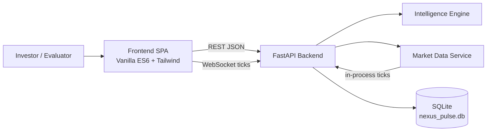
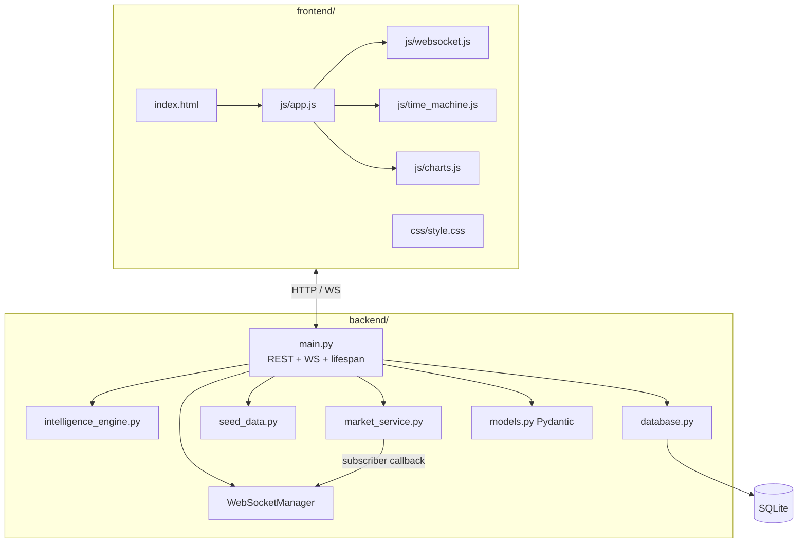
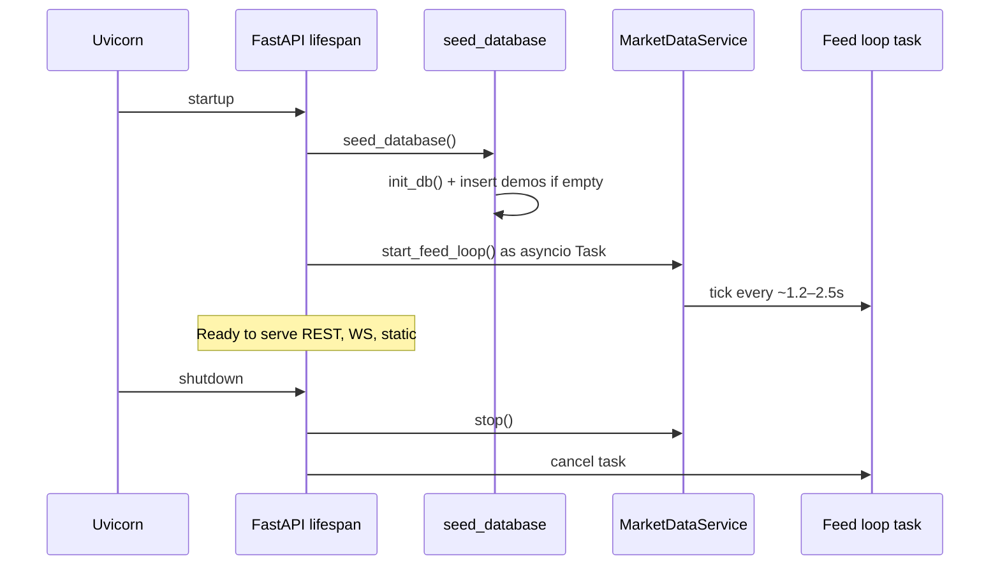
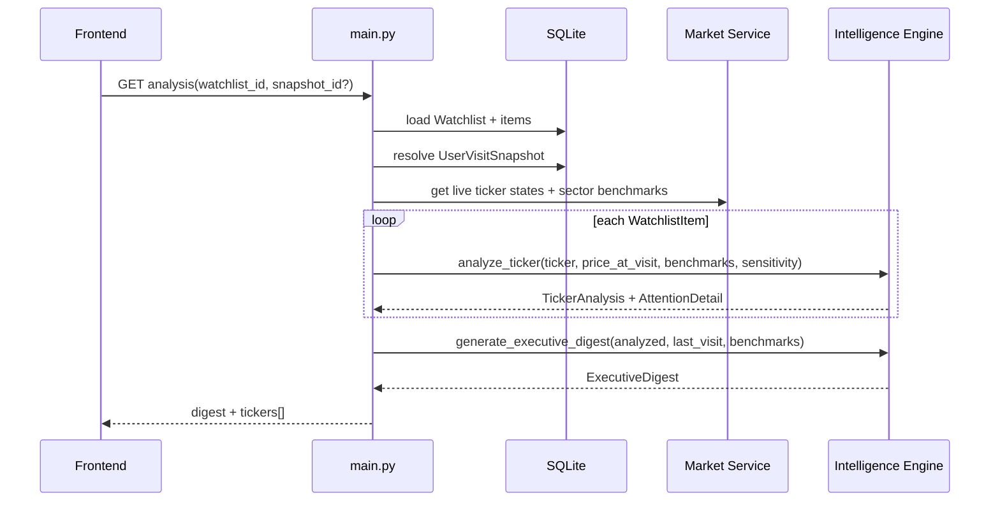
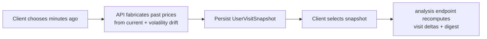
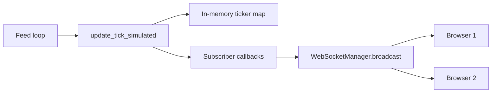
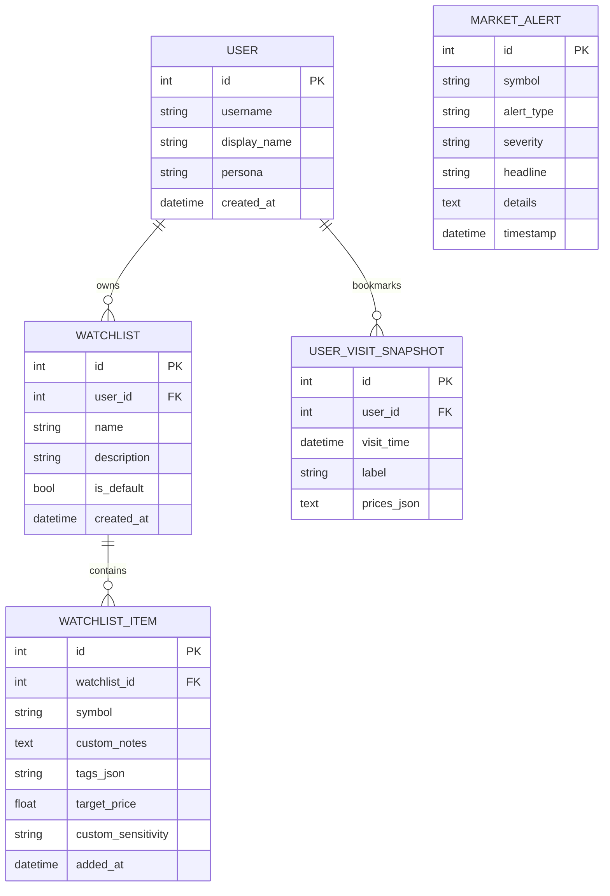
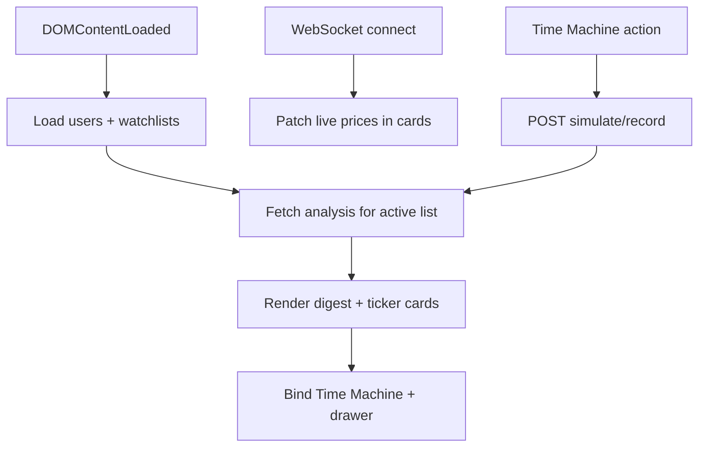

# Architecture — Nexus Pulse (SignalWatch)

This document describes the runtime architecture, data model, request/tick flows, and module responsibilities for the Intelligent Market Delta Attention Engine.

---

## Architecture diagram


> Source file: [`docs/architecture-diagram.svg`](./docs/architecture-diagram.svg)

**Deployment shape:** one Python process (`python run.py` → Uvicorn) serves API, WebSocket, and static frontend.

---

## 1. System context



---

## 2. Component architecture



### Responsibilities

| Component | Responsibility |
|---|---|
| `run.py` | Process entry; binds `0.0.0.0:8000` |
| `backend/main.py` | App lifespan, CORS, routes, static mount, WS hub |
| `intelligence_engine.py` | 5-dimension scoring, tiers, executive digest |
| `market_service.py` | Seed universe, tick simulation, sector benchmarks |
| `database.py` | SQLAlchemy models + session factory |
| `models.py` | Request/response Pydantic schemas |
| `seed_data.py` | Idempotent demo users / lists / snapshots / alerts |
| `frontend/js/app.js` | State, rendering, watchlist CRUD orchestration |
| `websocket.js` | Live connection, heartbeat, reconnect |
| `time_machine.js` | Simulate / record visit snapshots |
| `charts.js` | Deep-dive Canvas charts + visit benchmark |

---

## 3. Startup sequence



On each tick, `MarketDataService` updates 1–3 symbols (GBM micro-steps + occasional jumps), then notifies subscribers. `main.py` registers a subscriber that broadcasts `TICK_UPDATE` to all open WebSockets.

---

## 4. Primary intelligence request flow

Endpoint: `GET /api/watchlists/{id}/analysis?snapshot_id=`



### Snapshot resolution rules

1. If `snapshot_id` provided and owned by the watchlist’s user → use it
2. Else → most recent `UserVisitSnapshot` for that user
3. Else → fallback reference time ≈ now − 2h (no prices)

---

## 5. Time Machine flow

Endpoint: `POST /api/users/{id}/snapshots/simulate`



Special demo bias: NVDA / TSLA receive larger calibrated deltas so evaluators reliably see Priority signals.

---

## 6. Realtime tick path



Message shapes:

- `{ "type": "CONNECTION_ESTABLISHED", ... }`
- `{ "type": "TICK_UPDATE", "ticks": [...], "timestamp": ... }`
- Client `{ "action": "PING" }` → `{ "type": "PONG" }`

---

## 7. Intelligence scoring pipeline

```mermaid
flowchart TB
  IN[Ticker state + price_at_visit + sector benchmarks] --> D1[1 Visit Δ %]
  IN --> D2[2 Z-score vs σ]
  IN --> D3[3 RVOL]
  IN --> D4[4 MA / 52W crosses]
  IN --> D5[5 Catalyst + sector divergence]
  D1 --> SUM[Sum components]
  D2 --> SUM
  D3 --> SUM
  D4 --> SUM
  D5 --> SUM
  SUM --> SENS[Apply sensitivity multiplier]
  SENS --> CLIP[Clamp 0–100]
  CLIP --> TIER{Tier}
  TIER -->|≥60| P[PRIORITY]
  TIER -->|32–59| N[NOTEWORTHY]
  TIER -->|else| S[STEADY]
  CLIP --> REASONS[Plain-English reasons[]]
```

Implementation: `backend/intelligence_engine.py` (`compute_ticker_attention`, `analyze_ticker`, `generate_executive_digest`).

---

## 8. Data model (ER)



**Note:** Live quotes are **not** the source of truth in SQLite. Quotes live in the in-memory `MarketDataService.tickers` map. SQLite stores identity, preferences, and visit benchmarks.

---

## 9. API surface map

```mermaid
flowchart LR
  subgraph REST
    H[/api/health]
    U[/api/users...]
    W[/api/watchlists...]
    T[/api/tickers...]
    A[/api/alerts]
    S[/api/users/.../snapshots...]
  end
  subgraph WS
    L[/ws/live]
  end
  subgraph Static
    I[/ → index.html]
    ST[/static/*]
  end
```

| Concern | Endpoints |
|---|---|
| Health | `GET /api/health` |
| Personas | `GET /api/users` |
| Watchlists | `GET/POST /api/users/{id}/watchlists`, `DELETE /api/watchlists/{id}` |
| Items | `POST/DELETE .../items` |
| Intelligence | `GET /api/watchlists/{id}/analysis` |
| Time Machine | `GET/POST .../snapshots`, `.../record`, `.../simulate` |
| Discovery | `GET /api/tickers/search`, `GET /api/tickers/{symbol}/detail` |
| Alerts | `GET /api/alerts` |
| Live | `WS /ws/live` |

Interactive OpenAPI: `http://localhost:8000/docs`

---

## 10. Frontend architecture



State is held in `app.js` (active user, watchlist, snapshot, analysis payload). There is no SPA router/build pipeline — intentional for zero-friction demos.

---

## 11. Market simulation model

`MarketDataService` initializes a liquid multi-sector universe (`NVDA`, `AAPL`, `MSFT`, `TSLA`, `AMZN`, `GOOGL`, `META`, `AMD`, `SPY`, `QQQ`, `PLTR`, `COIN`, …) with:

- Base price, volatility, avg volume, SMA50/200, 52W range, beta
- 30-day synthetic OHLCV bars
- Intraday sparkline points
- Optional seed catalysts for volatile names

Each tick:

1. Sample a few active symbols
2. Apply Gaussian shock scaled by volatility
3. Occasional jump shock (~3% chance)
4. Update high/low/volume/sparkline/`data_health`

Sector benchmarks = average 1D % move of tickers in each sector (used for decoupling).

---

## 12. Testing strategy

| Suite | File | Focus |
|---|---|---|
| Unit | `tests/test_intelligence.py` | Visit delta, Z-score tiers, digest structure |
| API | `tests/test_api.py` | Health / analysis smoke paths |

Run:

```bash
python -m pytest tests -q
```

---

## 13. Operational notes

| Topic | Detail |
|---|---|
| Process model | Single Uvicorn worker (demo) |
| DB file | `./nexus_pulse.db` (gitignored) |
| CORS | Open (`*`) for local flexibility |
| Port | `8000` |
| Static root | `frontend/` mounted at `/static`, index at `/` |
| Extensibility | Swap `update_tick_simulated` for a live provider without changing scoring API |

---

## 14. Security & compliance posture (demo)

- No authentication / authorization
- No secrets required for local run
- Simulated quotes — not a regulated data product
- Do not expose publicly without auth, rate limits, and a licensed feed

---

## 15. Design ↔ architecture traceability

| Design goal | Architectural mechanism |
|---|---|
| Temporal context | `UserVisitSnapshot.prices_json` + analysis endpoint |
| Meaningful change | `IntelligenceEngine` 5-dimension composite |
| Narrative briefing | `generate_executive_digest` |
| Demoability | `/snapshots/simulate` + frontend Time Machine |
| Low cognitive load | Tier chips + reason strings + digest-first UI |
| Honest feed state | `data_health` field on ticker payloads |
| Simple ops | One process, SQLite, no frontend build |

For product rationale, see **[DESIGN.md](./DESIGN.md)**. For quick start, see **[README.md](./README.md)**.
